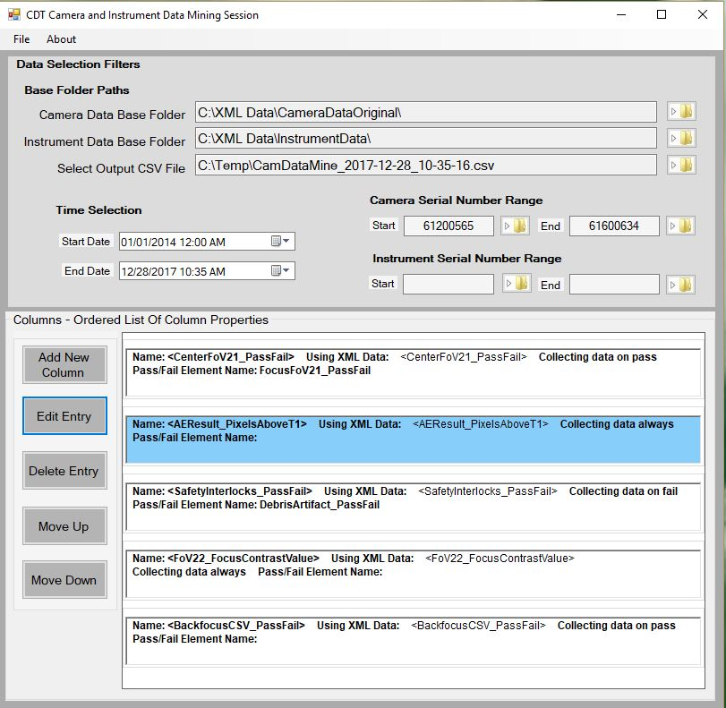
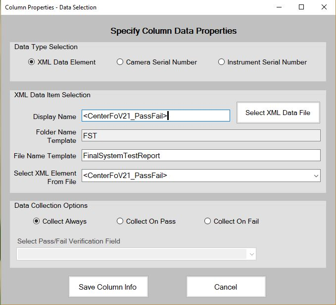

###### OVERVIEW ######

XMLExt is a tool that allows the user to specify an XML element in a camera
or instrument test folder, and generate a CSV file of the bindings of that XML
element over a range of folders. For instance, if a user wanted to see all of 
the results of the <FocusFoV9_PassFail> camera test which resides in "PSVTest"
folders over camera folders 61200565 to 61600602, they would create a query 
for FocusFov9_PassFail. For every camera folder in the range of folders, it would
find the XML binding of that entry (since it is a pass/fail test, it would be 
"pass" or "fail") and then append that entry to the CSV file. If the element is
not found, or the element does not match the pass fail criteria (explained later),
the program appends a ",", which in a CSV file is a empty entry. Users can run
more than one query over a range of files in one test. In the CSV file, each folder
is represented as the first entry on the line, and every column represents the query 
we are doing. It would look something like this:

serial number,<FocusFov9_PassFail>,<FocusFov21_PassFail>,
61200565,pass,pass,
61200617,pass,,,

Here we see the serial number column, whose value at any particular row is the 
folder name we are examining in that row. Then we have <FocusFov9_PassFail>, all 
entries in this column are from <FocusFov9_PassFail> tests, and the row they are
in corresponds to the folder we are testing. So, for camera serial number 61200565
both the <FocusFov9_PassFail> and the <FocusFov21_PassFail> tests passed. For camera
serial number 61200617 <FocusFov9_PassFail> passed, but the <FocusFov21_PassFail> 
value could either not be found, or did not match the pass fail criteria. Obviosly
this is a toy example, most real tests would include more serial numbers and elements
to search for.

###### USAGE ######

-- Data Selection Filters --

After starting the program, you should see the user interface. It contains three main
sections. The file menu at the very top, a collection of tools called the "Data Selection
Filters" and a large box that contains a panel and several buttons labeled "Columns -
Ordered List Of Column Properties". Every time you start a new session, the first thing 
you will need to do is fill out the Data Selection Filters section. Broadly, this section
allows the user to narrow down the kind of search they are doing.

	1. Base Folder Paths
		Used to specify the base folder where all the camera or instrument data is stored.
		Click on the folder icon to open up a folder browser that allows you to select these
		base folders. Once you have selected the folder you are interested in, make sure to 
		click "Ok". In addition to the Camera Data Base Folder and Instrument Data Base 
		Folder there is a Select Output CSV File. This is the location of the CSV file you 
		want the results of the test to be written to. If you have not created one, simply 
		navigate to the location in your file system where you would like the CSV file to
		be saved and then type the name of the CSV file you want to create in the "file 
		name" section at the bottom of the folder dialog. It will create this file with the
		CSV file extension (.csv). Additionally it will only display CSV files in the dialog.
		You need to specify the base folder of the kind of test you are doing, however you
		can do not have to specify the base folder of the kind of test you are not doing.
		For instance you do not have to specify the base instrument folder if you are
		doing a camera test. YOU ALWAYS NEED TO SPECIFY THE OUTPUT CSV FILE.

	2. Time Selection
		This allows the user to specify the date range of tests they are interested in.
		Tests that are before the Start Date and after the End Date are out of date range.
		During the test, if a folder is out of date range, it is excluded. If a file is 
		excluded due to date constraints, its full path is put in the .log file that is
		generated at the end of the test.

	3. Instrument Serial Number Range/Camera Serial Number Range
		Allows the user to specify the range of folders they are interested in. IT IS REQUIRED
		THAT YOU DO SO. Instrument folders that before the start range or after the end range
		are not included in test. It is good practice to only specify the the range that 
		corresponds to the kind of test you are doing (Don't specify instrument serial number
		range if you are doing a camera test). If you do you will be greeted with another dialog
		when you start the test that asks whether you are doing a camera test or an instrument
		test.

-- Columns - Ordered List Of Column Properties --

After you have specified the data selection filters for the session you will need to specify
the precise data you are looking for. You do this by creating a new column in the CSV file
that will be created when you start the test. To do this you click the "Add New Column"
button. This process is complex and gets a section of its own and will be covered later,
here we will cover the functionality of the other buttons in this section. All of these 
buttons, except the add new column button, require that the column property in question be 
selected. This is done simply by clicking anywhere on the column property you want to select
in the large panel to the right of the buttons.

	1. Edit Entry
		Edit the selected entry using the Add New Column dialog. All the fields are filled in
		with whatever the entry was created with.

	2. Delete Entry
		Deletes the selected entry.

	3. Move Up/Move Down
		Moves the selected graphical entry up or down in the panel.

-- Add New Column -- 

When you click on the Add New Column button a new dialog will appear. This dialog has 
three distinct sections: Data Type Selection, XML Data Item Selection, and Data Collection
Options.

	
	1. Data Type Selection
		Like its name suggests, this section allows the user to specify what kind of data
		they are going to collect. There are three options to choose from. The Use Camera
		Serial Number and the Use Instrument Serial Number options will simply put the serial
		number of the particular camera or instrument folder on the csv line. If you select
		one of these options, you can simply hit apply and the column property will be added
		The third option, which is selected by default is Use XML Data Element. Most if no all 
		entries will use this option. This option says that the entry for this column will be 
		an XML element extracted from a camera or instrument folder. If you are doing an 
		instrument test click the "This is an instrument serial number test" checkbox.

	2. XML Data Item Selection
		Once you have filled out the Data Type Selection section, you are ready to specify
		the XML element you are interested in. Click on the Select XML Data File button. This
		will open up a file dialog. Next select the particular file you are interested in. 
		The dialog will only show XML files (.xml) for you to select. When you have done this, 
		the Folder Name Template and the File Name Template sections will be filled out 
		automatically. At run time, when the program is searching through files, it will use 
		the folder name template to narrow down the search for viable folders, and the file 
		name template to narrow down the search for viable files. You do not need to fill in or
		alter these sections in any way. Next we will need to specify the exact XML element we
		are interested in. At the bottom of this section there is a combobox called Select
		XML Element From File. Clicking on this will display all the XML elements in the file.
		After selecting the one you are interested in the Display Name Textbox at the top of 
		this section will get filled in with the tag of the XML element you just selected. 
		This is the name of the column property, and you can change it from its default value.

	3. Data Collection Options
		This next step is only necessary if you are doing a camera test. Since most of the XML
		values in the camera tests represent some sort of test that could either pass or fail
		this section allows the user to specify what kind of test results they are interested in.
		When the program has found the XML element the user specified, it then checks the pass 
		fail criteria of the Pass/Fail Verification field. If the element of the pass fail 
		verification field and the Collect on Pass/Fail/Always match the element is added to the
		CSV file, otherwise a "," is appended in its place. What this allows the user to do is
		to only collect data on instruments that pass or fail. Often times the Pass/Fail 
		verification field is the same element that you selected from the XML Data Item Selection.
		The three radio buttons Collect All Fields, Collect On Pass, and Collect On Fail. Collect
		All Fields means we are collecting the XML binding no matter whether it is pass or fail,
		collect on pass means we are only collecting the XML binding if it is pass, otherwise we
		append a ",". Collect On Fail is the same but it will only collect if the binding is fail.
		If the data you are collecting is not a pass/fail test (maybe the binding is a number or
		a date, or some other kind of text) simply select Collect All Fields. Not doing so will 
		result in a "," always being appended. For instance, you could select <FocusFov9_PassFail>
		as the XML element you are interested in, and then put <FocusFov9_PassFail> as the Pass/Fail
		verification field. 

When you have filled out all the necessary information for this column entry simply click the 
Apply Changes button at the bottom. If you wish to discard the entry completely click the Cancel
button next to the Apply button. After you have hit Apply Changes you will see the graphical 
representation of the column property appear in the panel. From here you can click on it to 
select it and perform the various functions like editing and moving described earlier.

-- File Menu --

At the very top of the user interface there is a menu bar. This contains two menu entries, one
labeled File and the other labeled About. The About menu is fairly simple: it contains this readme 
and other help resources. The File entry contains all the functionality for running, saving, loading
a session.
	
	1. Collect Data
		Starts the test. Only click this when you have filled out all the necessary information for 
		the test. When the test is completed a message will appear on screen letting you know the 
		test was completed. Additionally a log file will be generated and saved in the same folder
		as the CSV file you specified at the beginning of the session. It will be of the form 
		camTestResults_yyyy_MM_dd-hh-mm-ss.log for camera tests or instTestResults_yyyy_MM_dd-hh-mm-ss.log
		for instrument tests.  

	2. Start New Session
		Starts a new Session, all the sections on the user interface such as the Data  
		Selection Filters and the Ordered List Of Column Properties will be blank, and all internal 
		memory of the session will be wiped. If you run a test and wish to to another you cannot simply
		change some of the test criteria. You must click the Start New Session button. You do not always
		have to fill out all the data again. After you click the Start New Session button you can load
		a previous session and begin editing it as you see fit. You simply must be sure to click the 
		Start New Session button after finishing a test and starting a new one.

	3. Save Session/Save Session As
		Clicking on the Save Session or Save Session As dialog will save the Session. Simply clicking 
		Save Session requires that there already be a save file associated with this test. If there is not
		Save Session As is called instead, which brings up a filedialog showing only binary files (.bin).
		If you wish to create one simply fill out the file name textbox at the bottom of the dialog and hit
		Ok. This will save the file as a .bin file. This file can be loaded from at any point. If you have 
		run a test and want to load a session make sure to click the Start new Session button first before 
		loading.

	4. Load Session
		Opens a file dialog that shows only binary files. Select the file you want to load and click Ok. 
		You should see all the fields from this saved file populate the user interface. If you are loading 
		in a new save after you have run a test, make sure you click the Start New Session button before
		doing so.

	5. Exit
		Exits the application. If you are in the middle of filling out a session make sure to save. Data
		is not saved automatically on exit.

###### END ######